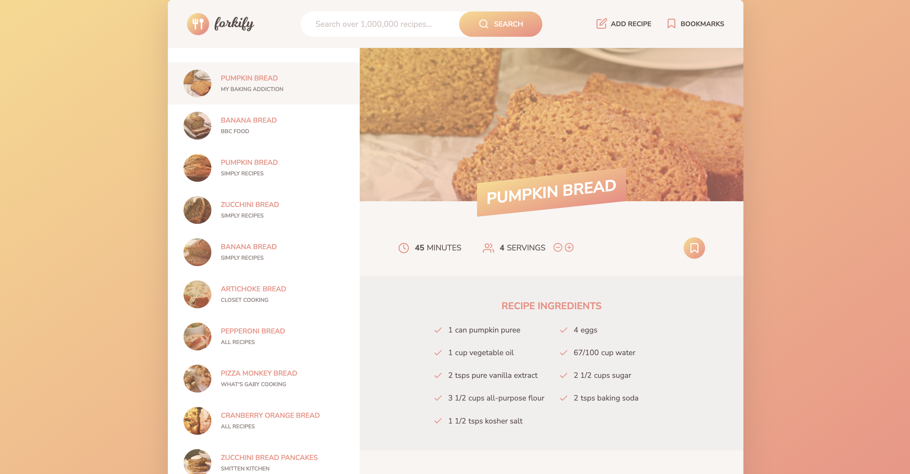
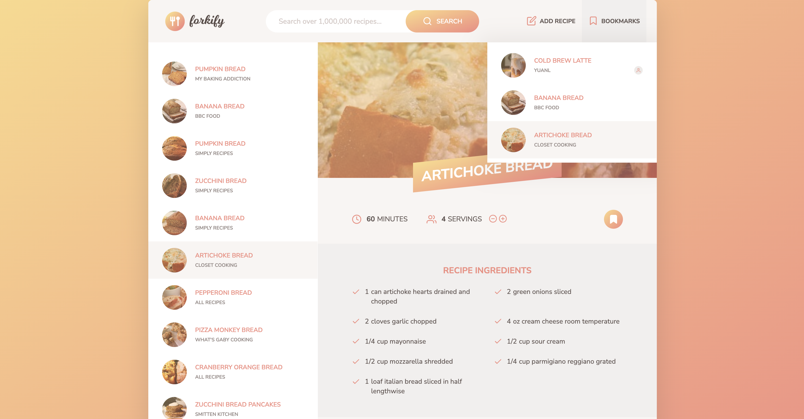
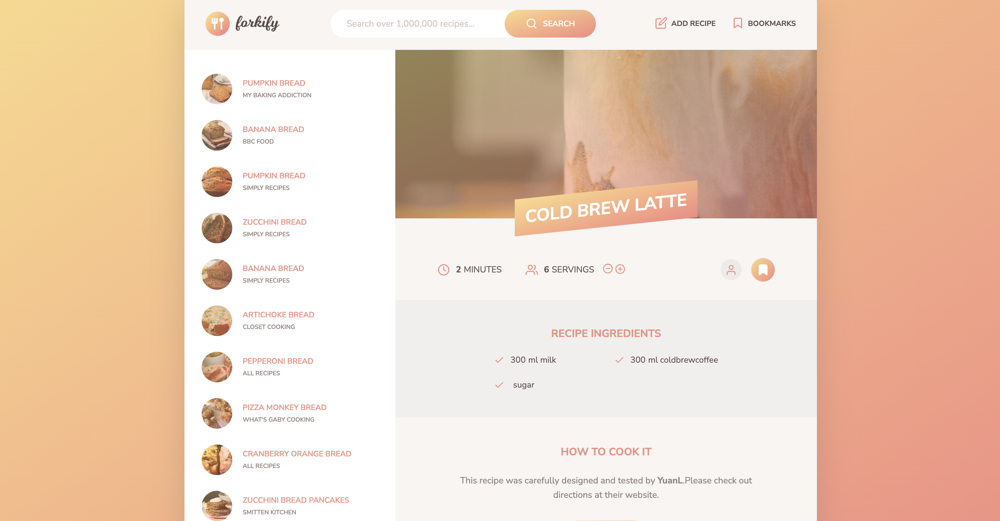
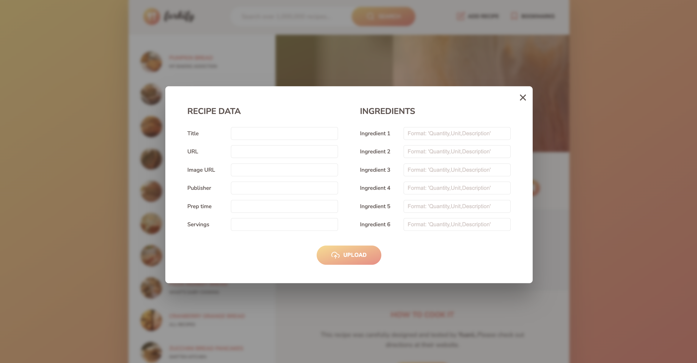

# Forkify

- This is a exercise from 'The Complete JavaScript Course 2024'.
- User can search recipes.
- User can upload their own recipes.
- User can markup recipes they like.
- User can change servings they want.
- The markup recipes save in the local storage.

- Screenshot:
  
  
  
  

## Built with

- HTML
- SCSS
- JavaScript

## Author

- The Complete JavaScript Course 2024 by Jonas Schmedtmann
- YAL
